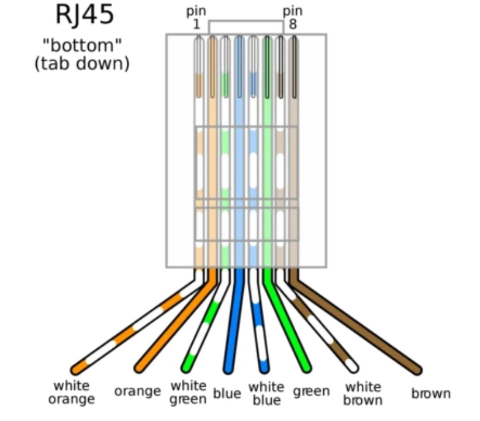

# AECC battery as a Marstek battery for HBC (ESPHome)

ESPHome firmware for an **M5Stack Atom S3 Lite**. The Atom connects over **RS485 (Modbus)** to an AECC-platform home battery, such as the Voltdeer SR5000 Pro, and makes it look like a **Marstek Venus** battery (HBC slot **M1**) in Home Assistant. You can then control it with [Home Battery Control (HBC)](https://docs.homebatterycontrol.com/), [GitHub](https://github.com/gitcodebob/marstek-venus-rs485-node-red), like a real Marstek battery.

You don't need a Home Assistant template package or automation: the ESP exposes the Marstek entities itself and turns the HBC commands into power setpoints.

## File

| File | HBC battery slot | Hostname | Entity prefix |
|---|---|---|---|
| `aecc_battery_rs485_to_marstek_m1.yaml` | M1 | `marstek-m1` | `marstek_m1_` |

## How it works

- **Telemetry**: SOC, battery, grid and PV power, temperatures and lifetime energy are read over Modbus (9600 baud, address 1).
- **Control**: HBC sets *RS485 Control Mode*, *Forcible Charge/Discharge* and *Forcible Charge/Discharge Power*. The ESP turns these into one setpoint and writes it to register `0xFE16` every second. The setpoint is limited by *Max Charge/Discharge Power* and the *Charge/Discharge Limit* (SOC).
- **Energy manager**: the battery's own WiFi module (JSON API on TCP port 8080) is switched to custom mode. Its schedule slot is kept equal to the setpoint, so a missed Modbus write doesn't change the battery power.
- **Release**: when RS485 Control Mode is `disable` and User Work Mode is `anti-feed` or `ai`, the battery goes back to its own *Self-Consumption (AI)* mode.

## Entities used by HBC

| Type | Entities |
|---|---|
| sensor | `marstek_m1_device_name`, `_battery_state_of_charge`, `_battery_voltage`, `_battery_total_energy`, `_battery_remaining_capacity`, `_ac_power`, `_battery_power`, `_inverter_state`, `_inverter_state_number` |
| number | `marstek_m1_forcible_charge_power`, `_forcible_discharge_power`, `_max_charge_power`, `_max_discharge_power`, `_charge_to_soc` |
| select | `marstek_m1_rs485_control_mode`, `_forcible_charge_discharge`, `_user_work_mode` |

*Battery Voltage* and *Battery Total Energy* are fixed values from the substitutions, because the inverter doesn't report them.

## Hardware

| Part | Notes |
|---|---|
| **[M5Stack AtomS3 Lite](https://www.tinytronics.nl/nl/development-boards/microcontroller-boards/met-wi-fi/m5stack-atom-s3-lite-esp32-s3-development-board)** (ESP32-S3) | `esp32-s3-devkitc-1`, 8 MB flash, ESP-IDF framework |
| **RS485 transceiver:** [M5Stack Atomic RS485 Base](https://www.tinytronics.nl/nl/communicatie-en-signalen/serieel/rs-485/m5stack-atomic-rs-485-base) | UART on **GPIO6 (TX)** / **GPIO5 (RX)**, 9600 baud, 8N1 |
| **Cable to the inverter** | RS485 on the inverter's RJ45 port. The pins depend on your brand (see below). |

**RJ45 pinout (Modbus A / B), tested:**

| Battery | Modbus A | Modbus B |
|---|---|---|
| Voltdeer SR5000 (Pro) | pin 2 | pin 1 |
| Humsienk Nova 7.68 kWh | pin 7 | pin 8 |



> ⚠️ **Wiring:** the RJ45 carries more than one RS485 bus (host port and BMS links). The bundled CT meter also bridges nets across pins. **Don't use a straight 8-wire patch cable.** Break out only the two conductors you need. See makstech's [PROTOCOL.md](https://github.com/makstech/esphome-aecc/blob/main/docs/PROTOCOL.md).

## Installation (ESPHome)

1. Copy `aecc_battery_rs485_to_marstek_m1.yaml` into your ESPHome config folder.
2. Make sure `secrets.yaml` contains `wifi_ssid` and `wifi_password`.
3. Edit the `substitutions:` at the top of the YAML:
   - `aecc_ip` (required): the IP address of the **battery's** WiFi module (JSON API)
   - `battery_device_name`: the name shown on the HBC dashboard
   - `battery_capacity_kwh` and `battery_nominal_voltage`
   - `ems_max_charge` / `ems_max_discharge`, and the default SOC limits (`ems_min_soc` / `ems_max_soc`)
4. Give the battery's WiFi module a **fixed IP / DHCP reservation** in your router.
5. Compile and flash (**ESPHome 2026.9.0 or newer**).
6. Close the vendor app (see the notes below).
7. Add the device in Home Assistant. Check that the entity ids start with `marstek_m1_`.
8. Configure battery M1 in HBC.

> 💡 **Updating / reflashing:** take HBC out of full control first, so *RS485 Control Mode* is `disable` and the battery runs in its own *Self-Consumption (AI)* mode. While the ESP restarts it can't write the setpoint. Under HBC control the battery would fall back to slot 3003 for that time. Give HBC control again afterwards.

## Dashboard (optional)

`dashboard_marstek_m1.yaml` is a ready-made Home Assistant dashboard view (tab) for the battery. It has gauges for the P1 meter, battery power and SOC, plus cards with the readings, the HBC controls and the ESP diagnostics.

**Add it as a new view (tab) to an existing dashboard:**

1. In Home Assistant, open the dashboard you want to use, for example *Overview*.
2. Click the **pencil icon** (top right) to edit the dashboard.
   If you're asked to *take control*, confirm it.
3. Click the **⋮ menu** (top right) → **Raw configuration editor**.
4. Find the `views:` list and paste the contents of `dashboard_marstek_m1.yaml` as a new item.
   Put `- ` before the first line (`type: masonry`) and indent the rest of the file by 2 spaces, so it lines up with the other views.
5. Click **Save**, close the editor and click **Done**.
   The new tab **Marstek M1** appears at `/<dashboard>/mt1`.

**Or create a separate dashboard for it:**

1. Go to **Settings → Dashboards → + Add dashboard → New dashboard from scratch**, give it a name and open it.
2. Click the **pencil icon** → **⋮ menu** → **Raw configuration editor**.
3. Replace everything with:
   ```yaml
   views:
     - <paste dashboard_marstek_m1.yaml here, indented by 4 spaces>
   ```
4. Click **Save** and **Done**.

**Before you save:**

- Change `sensor.p1_meter_power` to the entity of your own P1 / smart meter. You can find it under **Settings → Devices & services → Entities**.
- If an entity shows as *Entity not available*, check its id under **Settings → Devices & services → ESPHome → marstek-m1**. The ids must start with `marstek_m1_`.

The gauge for **My battery** uses the Marstek sign: **+ = discharging** (delivering to the house), **− = charging**.

## Notes

- **One JSON client at a time**: the battery's JSON API serves only one client. Close the vendor app and disable any other integration that uses port 8080, such as *AECC Battery (Local TCP)*.
- **No duplicate entities**: remove any old template package that creates the same `marstek_m1_*` entities (for example `aecc_battery_to_m1.yaml`). Otherwise the ESP's entities get a `_2` suffix.
- **Renamed device**: if you renamed the device, set `use_address` (under `wifi:`) to the old hostname for the first OTA upload, then set it back to `${name}.local`.
- **Change with care**: settings in the *Advanced* group, such as battery type, BMS protocol and grid standard, can damage the battery or the installation. Some are disabled by default.

## Credits

- Register map: [makstech/esphome-aecc](https://github.com/makstech/esphome-aecc)
- Work modes and JSON API: [StekkerDeal/aecc-battery-local](https://github.com/StekkerDeal/aecc-battery-local)
- HBC: [gitcodebob/marstek-venus-rs485-node-red](https://github.com/gitcodebob/marstek-venus-rs485-node-red)

Use at your own risk. This project is not affiliated with Marstek, AECC or Voltdeer.
